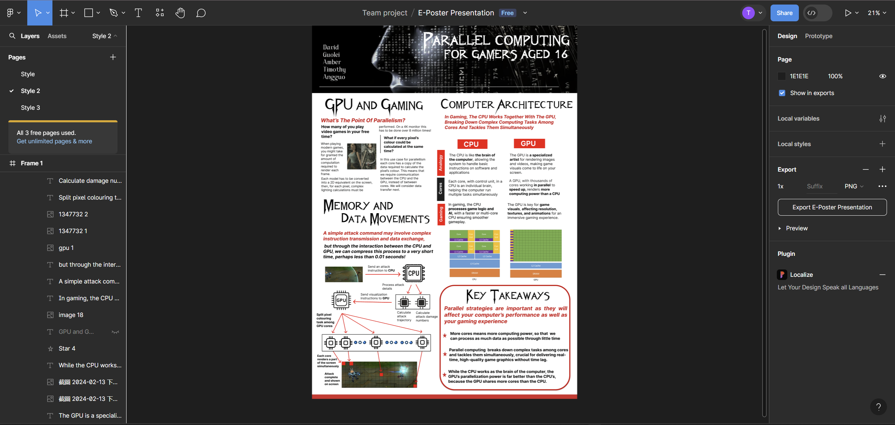

## This is a repository for Group 10's Communication Workshop Presentation/Poster Coursework

### This work was carried out as part of the Professional Skills Module within the MSc MISCADA programme at Durham University

#### Contents

1. E-Poster in .png format.
2. Images that are used within poster are stored in the ./images folder. These are either images created/edited by team members (such as the League of Legends grid image) or sourced from the internet.

#### Project Development Mentions.

Work was carried out using the Figma software, as seen below. Within this software, all team members were able to edit the poster at the same time (or in parallel hehe), making collaboration easier.  

